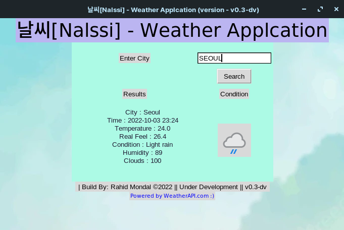
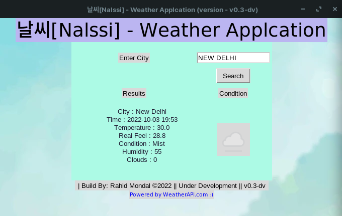

# 날씨 [Nalssi] - Weather Application

This is simple Weather Application Named - 날씨 [Nalssi]
- Console Version [fetch_logic.py] 

- Gui Version [app.py] - This is under development .

## Setup 
 
1. Clone the Repository and Add to your local machine  or Download as Zip file and Unzip The Files in Your Desired Directory File
```bash
git clone https://github.com/rahidmondal/WEATHER-APPLICATION.git 

```

2. Create a Folder name .env 
3. Go to [Weather  API](https://www.weatherapi.com/) site and Create a account and Obtain API Keys .

4. Add the API keys in the .env file as below formate
```
API_KEY=(Insert the API Keys Here without brackets or Semi colons) 
```
5. Download All Dependencies through requirement's.txt file

6. Test the working - Fell Free To Open a pull request for any Issue 

7. Setup Finished 


## Demo Image




## Changelog
* v0.1-dv : Basic Application With only Console Version and Gui Basic
* v0.2-dv : More Development in GUI part with Icon Part
* v0.3-dv : Dynamic Icon and Improved Code
* v0.4-dv : Use of Pysimple GUi for better Ui (New Part - Extra Dev) - First Executable file  .

## License
[](licence)


