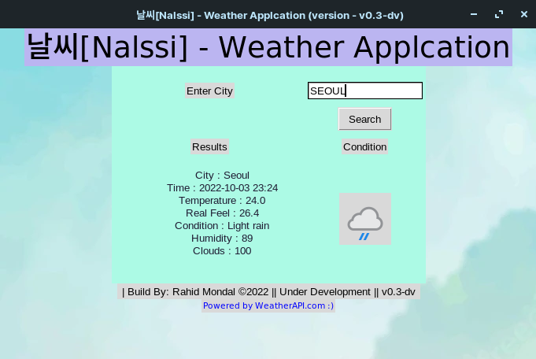
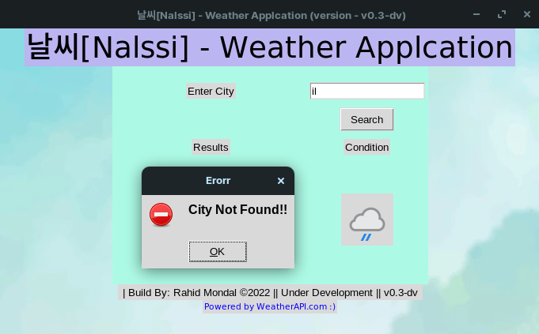
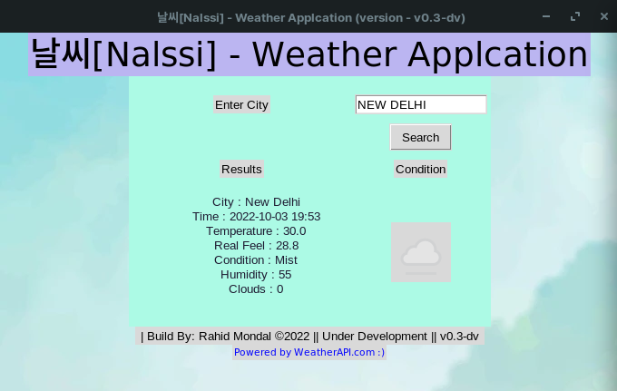

# 날씨 [Nalssi] - Weather Application

This is simple Weather Application Named - 날씨 [Nalssi]
This Weather Applcation will  have Three Sub-Applcation

- Console Version [fetch_logic.py] 

- Gui Version [app.py] - This is under development .

- Web Version - This is planned 

## Setup 

## Environment Variables
This Project runs on Api inorder to run the application Properly you 
Have to create a .env file and Add Api Key in it 

To get Api key go to  
https://www.weatherapi.com/

Create a Free account and Generate a Api Key 

## Demo Image

## Changelog

## License

[MIT](https://choosealicense.com/licenses/mit/)

